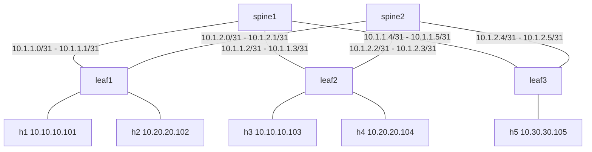

# Topology (generated)

```mermaid
graph TD
  spine1 ---|"10.1.1.0/31 - 10.1.1.1/31"| leaf1
  spine1 ---|"10.1.1.2/31 - 10.1.1.3/31"| leaf2
  spine1 ---|"10.1.1.4/31 - 10.1.1.5/31"| leaf3
  spine2 ---|"10.1.2.0/31 - 10.1.2.1/31"| leaf1
  spine2 ---|"10.1.2.2/31 - 10.1.2.3/31"| leaf2
  spine2 ---|"10.1.2.4/31 - 10.1.2.5/31"| leaf3
  leaf1 --- h1["h1 10.10.10.101"]
  leaf1 --- h2["h2 10.20.20.102"]
  leaf2 --- h3["h3 10.10.10.103"]
  leaf2 --- h4["h4 10.20.20.104"]
  leaf3 --- h5["h5 10.30.30.105"]
```
